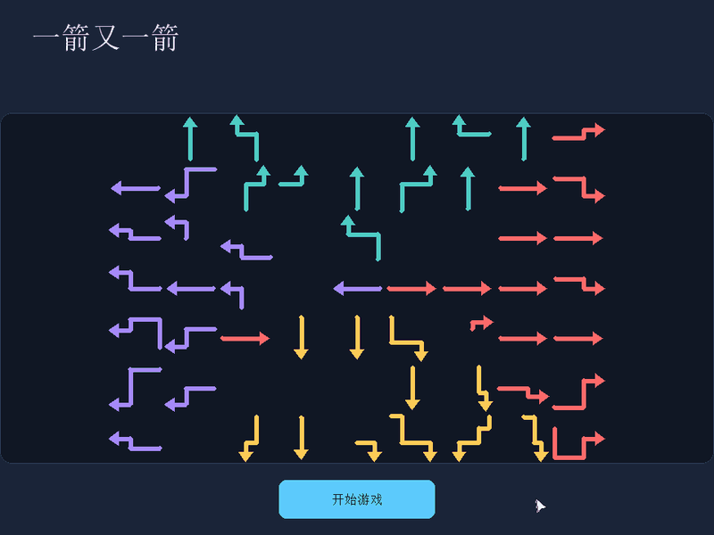
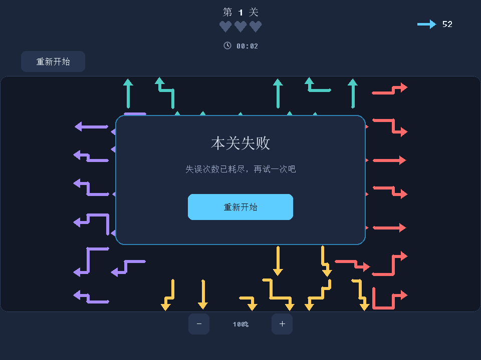

| 项目 | 内容 |
| --- | --- |
| 这个作业属于哪个课程 | [课程链接](https://edu.cnblogs.com/campus/fzu/202601SofwareEngineering) |
| 这个作业要求在哪里 | [作业要求](https://edu.cnblogs.com/campus/fzu/202601SofwareEngineering/homework/16717) |
| 这个作业的目标 | 使用 Python 和 AIGC 完成“一箭又一箭”小游戏 |
| 学号 | 052402132 |
| GitHub 仓库 | [FZU-SE2701](https://github.com/LYanl7/FZU-SE2701)（项目位于 `task02`） |

# 使用 Python 与 AIGC 完成“一箭又一箭”小游戏

## 一、项目展示

下面的 GIF 完整展示第一关从开始游戏到通关的过程：进入棋盘、点击被阻挡的箭头并触发碰撞反馈、按顺序消除全部 52 个箭头，最后显示通关结果。




<details>
<summary>查看失败界面</summary>



</details>


## 二、项目介绍

### 游戏规则

“一箭又一箭”是一款通过观察方向与阻挡关系来安排消除顺序的小游戏。玩家点击箭头后，程序检查箭头尖端沿前进方向到棋盘边界之间是否存在其他箭头：没有阻挡时飞出并消失，有阻挡时播放碰撞反馈并扣除一次失误机会。

每关初始有 3 次失误机会。清空棋盘后显示通关结果，点击“下一关”继续；失误耗尽后显示失败结果，可以重新开始。重开恢复本关原始布局、失误次数和计时。

### 界面设计

界面采用深色背景，用青绿、珊瑚红、黄色和紫色分别区分上、右、下、左四种方向。首页展示棋盘预览和开始按钮，游戏界面顶部显示关卡、剩余机会、剩余箭头数量和用时，左上方提供重新开始按钮。

通关和失败结果通过居中的提示卡片展示，并提供下一关或重新开始的操作。箭头成功飞出和碰撞返回都有动画，让点击结果可以直接从画面中辨认。

### 主要功能与特色

- **直线与折线箭头：**使用横纵线段组合表示箭头，点击线条中部也能选中。
- **随机关卡：**第一关开始就使用生成布局，通关后持续生成后续关卡。
- **可解性检查：**生成器在显示关卡前计算完整消除顺序，检查布局能否通关。
- **逐步增加难度：**关卡密度和棋盘规模随关卡编号增加，并设置上限。
- **计时与缩放：**记录每关用时，支持滚轮和按钮缩放棋盘内容。

## 三、实现思路

### 分层结构

```text
task02/
├── main.py                       # 游戏入口
├── pyproject.toml                # Python 版本与依赖配置
├── requirements.txt              # pip 安装依赖
├── uv.lock                       # uv 依赖锁文件
├── src/
│   ├── model/
│   │   ├── arrow.py              # 坐标、方向、线段和箭头状态
│   │   ├── grid.py               # 棋盘占用与路径几何检测
│   │   └── game_state.py         # 关卡、失误和胜负状态
│   ├── logic/
│   │   ├── game_controller.py    # 点击处理、动画计时、重开和关卡切换
│   │   └── level_generator.py    # 随机关卡生成与可解性检查
│   └── presentation/
│       ├── app.py                # Pygame 输入、界面与动画
│       └── assets/clock.svg      # 计时图标
├── tests/
│   ├── test_gameplay.py          # 原有模型、生成器及生命周期测试
│   └── test_requirements.py      # 四向边界、失误耗尽、重开回归测试
├── tools/
│   ├── capture_screenshots.py    # 界面截图及三关交互验证
│   └── record_demo.py            # 完整游玩 GIF 录制
├── images/                      # 项目截图
├── README.md                    # 项目使用说明
└── blog.md                      # 开发与测试记录
```

表现层处理鼠标和绘图，逻辑层决定操作是否成功，模型层保存坐标与状态。核心规则不依赖 Pygame 窗口，便于单独测试。

### 箭头与方向表示

`Point(x, y)` 表示棋盘坐标，x 向右增加，y 向下增加。`Arrow.points` 是有序坐标序列，相邻两点构成水平或竖直线段，最后一点是箭头尖端。这样既能表示直线，也能表示多段折线。方向由 `Direction` 表示：

| 方向 | x 变化 | y 变化 |
| --- | --- | --- |
| 上 | 0 | -1 |
| 右 | +1 | 0 |
| 下 | 0 | +1 |
| 左 | -1 | 0 |

屏幕像素坐标会转换为棋盘坐标；点击线段中部同样可以选中箭头，不需要只点尖端。

### 路径与阻挡检测

从目标箭头的**尖端**沿其方向向边界检查其他箭头的线段。以向右为例，设尖端为 `(x0, y0)`：

- 对竖直线段：其 x 在尖端右侧，且其 y 区间覆盖 `y0` 时构成阻挡。
- 对水平线段：与尖端处于同一水平线，且至少有一部分位于尖端右侧时构成阻挡。
- 其余方向使用对应的轴与大小关系判断；排除目标箭头本身。

对应实现可查看 `grid.py` 的 `blocking_arrows()`，以及控制器中的 `_point_blocker_details()`。控制器还计算最近碰撞点，用于确定碰撞动画的前移距离。

当前折线模式使用“尖端前方路径”的判定，并非把整条折线平移后做刚体碰撞检测。基础单格箭头的同一行、同一列判定是这一规则的简单情况。

### 状态与动画

成功点击后，箭头进入 `FLYING_OUT` 状态，立即从逻辑占用中移除，画面继续播放飞出动画；动画完成后进入 `REMOVED` 状态。只有剩余箭头为零且待完成的飞出动画结束，才进入通关状态。

阻挡点击保留箭头并扣除一次机会，表现层播放前移、晃动和返回效果。重开会恢复初始布局并清空动画计时，防止重开前的动画影响新一轮游戏。

### 随机关卡与可解性

生成器将箭头放在棋盘中央约 70% 的横向区域，生成不重叠的横纵折线，再建立“某箭头被哪些箭头阻挡”的依赖关系。

`LevelGenerator.solution_order()` 不断选择没有剩余阻挡者的箭头，将它从依赖关系中移除。如果最终得到的消除序列覆盖所有箭头，关卡才具备完整解法。尝试失败时重新生成，并提供限制方向的后备生成方案。

关卡密度和棋盘规模随关卡编号逐步提高，并设有上限。游戏不是只有三张固定地图，通关后可以持续生成下一关。调试时可以使用 `GameController(generation_seed=2701)` 复现生成结果；正常启动不固定种子。

### 关键代码：求解消除顺序

下面节选自 `src/logic/level_generator.py` 的 `solution_order()`。其中 `dependencies[index]` 保存当前阻挡第 `index` 个箭头的其他箭头编号。

```python
while remaining:
    removable = next(
        (index for index in sorted(remaining) if not dependencies[index]),
        None,
    )
    if removable is None:
        break
    solution.append(removable)
    remaining.remove(removable)
    for blockers in dependencies.values():
        blockers.discard(removable)
```

每轮找到一个没有阻挡者的箭头，把它加入解法，再从其他箭头的阻挡集合中删除其编号。这相当于逐步解除依赖：如果所有箭头都能被处理，就得到完整解法；如果还有箭头却找不到可移除项，就存在互相阻挡的局面。

这也解释了为什么“箭头没有重叠”不足以证明关卡可通关：两个相互指向的箭头可以互不重叠，却仍互相阻挡。

## 四、AIGC 使用过程

本项目使用 **OpenAI Codex** 辅助开发。以下内容根据项目初始化、逻辑与界面修复、自动生成关卡等历史聊天记录整理，选取了从搭建项目到修正实际问题的代表性过程。部分开发任务按要求拆分给 Codex 的 subagent，分别处理表现层、逻辑层和数据模型层。

### 1. 协作过程概览

| 子任务 | AIGC 工具 | 提出的要求 | AI 实现或提供的内容 | 实际效果 | 人工修改或反馈 |
| --- | --- | --- | --- | --- | --- |
| 项目初始化与分层实现 | Codex | 使用 Python、Pygame，按表现层、逻辑层、数据模型层组织项目，再分三个 subagent 实现 | 创建工程骨架，分别实现箭头模型、阻挡检测、游戏状态、界面与动画 | 形成能够运行核心流程的初版，后续继续修复实际运行问题 | 明确三层职责、游戏规则及协作方式；纠正 AI 新建独立 Git 仓库的做法，要求在父仓库提交 |
| 字体加载崩溃修复 | Codex | 提供运行 `uv run python main.py` 的完整报错，要求分析并修复 | 定位 Windows 系统字体枚举异常，改为优先加载字体文件并提供默认字体回退 | 字体加载和渲染检查通过，解决启动时的异常 | 实际运行并提交错误堆栈；同时要求使用 uv 管理本地环境 |
| 点坐标建模与整段点击 | Codex（分层 subagent） | 箭头由点与点之间的连线组成；长箭头中部也应可点击，分段箭头要正确显示 | 使用有序点列与线段表示箭头，调整坐标映射、整条线段命中和射线阻挡检测 | 当时 8 项回归测试及长箭头中部点击验证通过 | 澄清“点坐标”和“不同颜色”的含义，指出坐标错位与只识别端点的问题，要求按方向配色并加粗箭头 |
| 飞出与碰撞反馈 | Codex | 飞出后不能留在原地；去掉底部说明文字，放慢飞出，让受阻箭头前移、颤抖并返回 | 完善飞出状态处理，把飞出时长调整到 0.7 秒，按最近阻挡位置计算碰撞动画目标 | 当时碰撞动画调整后的 9 项回归测试与动态渲染验证通过 | 指出残留箭头、箭头头部方块感和动画过快等问题，明确反馈效果 |
| HUD 与视觉布局 | Codex | 顶部显示关卡、红心和计时，右上角显示剩余箭头；调整棋盘留白与复古字体 | 重排 HUD，加入计时与 SVG 时钟图标，调整背景、字体和边距 | 当时 11 项测试及界面渲染检查通过 | 提供参考图，多次调整布局；最终要求取消点阵、扩大底部留白 |
| 随机关卡与缩放 | Codex | 全随机生成，提高密度和箭头多样性，支持缩放，保持棋盘外框比例 | 实现随机生成、固定种子复现、可解性检查及内容缩放，后续修正方向分布 | 最终阶段 13 项测试通过；历史抽样结果显示四方向比例接近均衡 | 指出折线理解偏差、折弯过多、上下方向过多以及开始前后棋盘尺寸不一致等问题 |

表中的人工参与主要是提出需求、运行反馈、提供参考图和纠正实现方向；具体代码修订由 Codex 执行。各阶段测试数量是当时聊天记录中的结果，当前完整测试结果见下一节。

### 2. 字体崩溃：从实际报错定位问题

使用 uv 启动游戏后，程序在绘制开始界面时出现异常。我将完整堆栈交给 Codex，并要求：

> 分析一下错误，然后起一个 subagent 去修

关键错误为：

```text
TypeError: expected str, bytes or os.PathLike object, not int
```

堆栈指向 `pygame.font.SysFont()` 调用的 Windows 字体枚举过程。Codex 将字体加载方式调整为优先读取 Windows 字体目录中的具体字体文件，在不可用时回退到默认字体，并保留字体缓存。

修复后完成了字体加载、缓存和渲染检查，对应提交为 `f3160e7 fix: make pygame font loading Windows-safe`。这个过程说明，AI 生成的代码即使通过语法检查，也需要在实际环境运行；具体堆栈比“程序打不开”更有助于定位问题。

### 3. 点与线段：纠正模型和点击判定

最初对“使用点坐标”的理解没有完全落实到箭头的几何表示上。我进一步说明：

> 构成一个箭头的基本元素是点与点之间的连线

随后又指出：

> 现在箭头似乎只有头部和尾部有点击判定，点击长箭头的中间没有任何效果。

Codex 据此联动调整三层实现：模型层用有序点列表示箭头，相邻点形成线段；表现层将点击位置转换为真实棋盘坐标；逻辑层检查点击位置与线段的距离，并用箭头尖端前方射线检测阻挡。

调整后，直线和折线的中部都能作为点击目标。历史记录中除了 8 项回归测试，还进行了 Pygame 端到端长箭头中部点击验证。同一轮协作还将“不同箭头用不同颜色”澄清为“不同方向采用不同颜色”，避免每支箭头随意配色。

### 4. 碰撞动画：让操作结果在画面中体现

初版存在成功飞出后原地仍显示箭头的问题，交互也较依赖文字提示。我提出：

> 放慢箭头飞出的速度，被阻挡的箭头可以飞到指定位置然后颤抖，回到原位。

Codex 修正飞出相关的状态与显示处理，将飞出时长由 0.35 秒调整到 0.7 秒；对受阻箭头，根据最近线段交点确定前移位置，再播放晃动和返回动画。底部“飞出”“被阻挡”的说明文字被移除，让动画本身表达结果。

这一阶段还调整了箭头头部与箭身的衔接，消除不自然的方块感。碰撞反馈调整后的记录显示，9 项回归测试和无窗口动态渲染验证通过。相关逻辑与界面完善归入提交 `8dbdfbf feat(task02): refine arrow gameplay and HUD`。

### 5. 随机关卡：从“能生成”改到“合理且可解”

最初的需求是：

> 我想在 task02 当中新增自动生成关卡的功能

随后补充全随机、高密度、更多折线箭头和棋盘缩放。Codex 实现生成器及可解性检查，但布局和形态还需要继续调整：我要求棋盘保持横向展开，箭头只分布在中间区域；折线由横纵坐标变化的点组成，避免一味增加折弯次数；缩放只改变棋盘内容，不改变外框相对界面的比例。

测试中还发现方向分布异常：

> 生成的箭头几乎全都是上下方向的，你的生成器逻辑绝对有问题吧。

Codex 检查后发现，方向选择依据整块宽棋盘的边缘距离，上下边通常更近，因此出现明显偏向。修正方式是按中央箭头生成区域的归一化位置选择方向，而不是直接比较整块棋盘的边缘距离。

当时聊天记录中的 60 个关卡抽样结果为：上约 24.6%、下约 25.2%、左约 25.3%、右约 24.9%。同时重新调整直线、一次折弯和“长—短—长”折线的比例，并记录了 6 个完整解序的验证，13 项测试全部通过。这些数字是该次历史抽样结果，并不表示每一关都严格等比例。

最后，我通过截图指出开始前后棋盘大小不一致，Codex 将开始页和游戏页的棋盘位置、尺寸统一。该阶段对应提交为 `a6c3cc1 feat(task02): add procedural levels and board zoom`。

## 五、测试过程与结果

### 测试方法

测试分为两部分：使用 `unittest` 验证模型与控制器的状态变化，再由截图脚本发送鼠标事件验证界面操作与关卡流程。单元测试检查消除、扣次数、边界和重开的精确结果，界面验证检查开始、失败、重开、通关和切关是否正确衔接。

### 执行命令与结果

在 `task02` 目录运行：

```bash
uv run python -m unittest discover -s tests -v
uv run python tools/capture_screenshots.py
```


| 编号 | 测试内容 | 预期结果 | 本次实际结果 | 结论 |
| --- | --- | --- | --- | --- |
| T01 | 点击前方无阻挡的箭头 | 飞出并消失 | 进入飞出状态，动画计时完成后移除；机会不减少 | 通过 |
| T02 | 点击被阻挡的箭头 | 箭头保留，机会减 1 | 四方向阻挡测试通过；模拟点击产生碰撞反馈，3 次机会降为 2 次 | 通过 |
| T03 | 点击边缘朝外的箭头 | 正常消除，无越界 | 上、下、左、右边缘用例均正常移除 | 通过 |
| T04 | 清除全部箭头并切关 | 显示通关，进入下一关 | 默认随机模式连续通关三关，前两关成功切入下一关 | 通过 |
| T05 | 耗尽失误机会 | 显示失败，允许重开 | 第三次阻挡点击后进入失败界面，重开恢复 3 次机会 | 通过 |
| T06 | 游戏中重新开始 | 恢复布局和机会 | 已扣机会、正在飞出的状态重开后，布局、计时、机会和动画队列均恢复 | 通过 |

原有测试还覆盖固定种子的可复现性、生成关卡可解性、折线点击、垂直线段阻挡和计时停止等行为。

本次测试使用固定种子复现关卡，已完成前三关的完整消除与切关流程。随机模式仍可生成更多布局，上述结果对应本次测试覆盖的关卡和用例。


## 六、PSP 表格

以下时间单位为小时；预计耗时和实际耗时需要根据开发记录填写。差异按“实际耗时 − 预计耗时”计算。

| 任务 | 预计耗时（小时） | 实际耗时（小时） | 差异（小时） |
| --- | --- | --- | --- |
| 需求分析与游戏设计 | 1 | 1 | 0 |
| Python 与图形库学习 | 0.5 | 0 | 0.5 |
| 游戏界面实现 | 1 | 1 | 0 |
| 路径与碰撞逻辑实现 | 1 | 1 | 0 |
| 关卡设计 | 0 | 0 | 0 |
| AIGC 辅助开发 | 5 | 3 | 2 |
| 测试与修改 | 1 | 1 | 0 |
| README 与博客撰写 | 1 | 1 | 0 |
| 合计 | 10.5 | 8 | 2.5 |


## 七、心得体会

这次项目里，AI 帮忙完成了不少代码编写和排错工作，从搭建三层结构到调整动画、生成关卡，开发效率确实提高了。不过，需求还是要说清楚，比如折线箭头的表示方式、不同方向的配色，以及缩放时棋盘外框是否变化，都经过了几轮沟通才达到预期。

实际运行也很重要。代码能启动，不代表所有细节都正确，长箭头中间点不到、生成的箭头大多朝上下等问题，都是检查效果后才发现的。把问题描述具体，再结合测试去修改，比直接让 AI “优化一下”更有效。

做完这个小游戏，对坐标转换、路径检测和游戏状态之间的关系有了更直观的理解。整体上，AI 能省下不少重复工作，但最终效果仍然需要自己判断，不能只看它说“已经完成”。

## 八、资源与仓库说明

箭头、棋盘、爱心和按钮由 Pygame 绘制；计时图标位于 `src/presentation/assets/clock.svg`；展示截图来自本项目；字体使用系统字体。Pygame 是第三方依赖。计时 SVG 未附外部来源标注，如其存在外部参考，应依据实际来源补充署名。

项目代码位于 [GitHub 仓库](https://github.com/LYanl7/FZU-SE2701)的 `task02` 目录。本地已有初始化、基础玩法、字体修复、界面完善、随机生成与缩放等阶段的提交记录。
